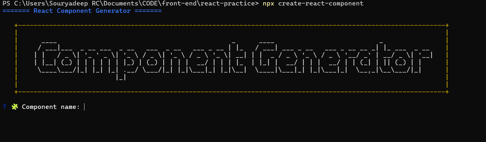
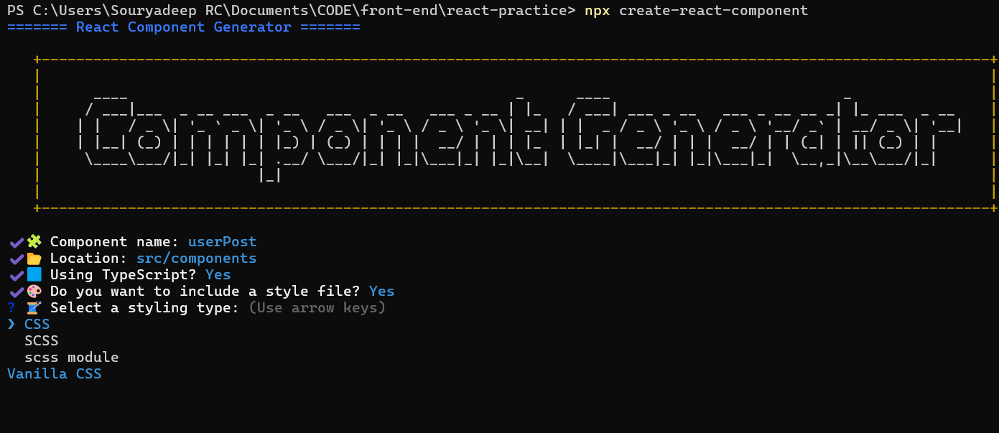
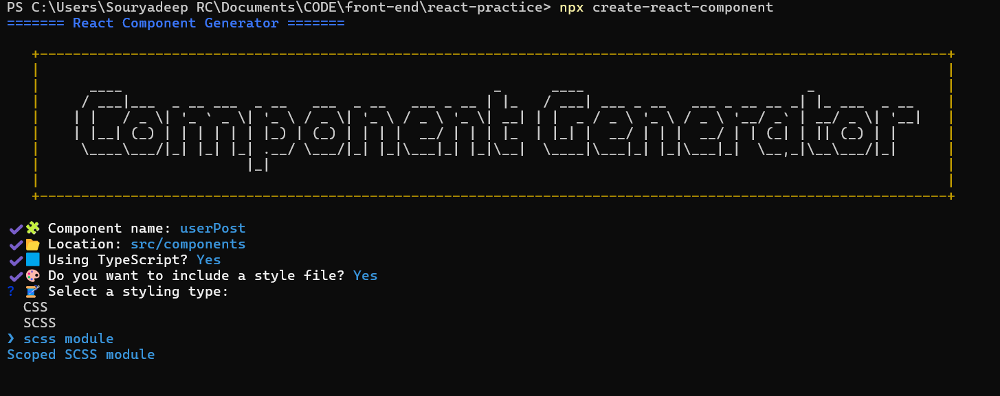
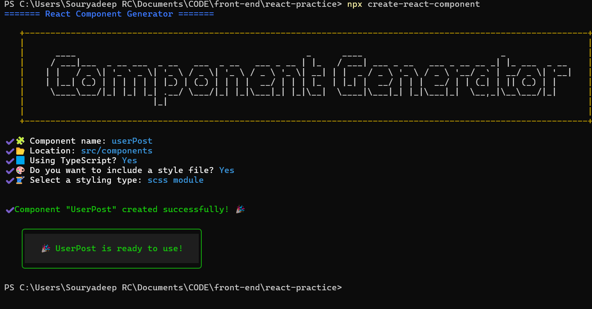
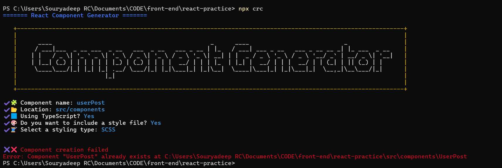

# 🚀 Kickstart Frontend


> A CLI tool to scaffold customizable React component structures, instantly.

    

---

## 📦 Installation

Install at specific project
```bash
npm install kickstart-frontend 
```

OR 

Install globally
```bash
npm install -g kickstart-frontend
```
### Using NPX (recommended)

```bash
npx create-react-component
```
OR 

```bash
npx crc
```

## 🎯 Features

📁 Create React components with consistent structure

⚙️ Supports both JavaScript and TypeScript

💅 CSS, SCSS, and SCSS Modules integration

🧠 Intelligent prompts to guide your setup

🖼️ Automatically generates component file + style sheet

✅ 100% test coverage with Jest


## 🛠️ Usage
```bash
npx create-react-component
```
You will be prompted for:

- Component name
- Target location (default: src/components)
- Language (JavaScript / TypeScript)
- Styling options (CSS / SCSS / SCSS Module)

## 📁 Output Example

### If you choose:

- Name: Post-Card
- Type: TypeScript
- Style: SCSS Module

### It generates:
```bash 
src/
└── components/
    └── PostCard/
        ├── PostCard.tsx
        └── PostCard.module.scss
```

## Demo





For Duplicate scenarios


## ✨ Aliases
You can use either of the following commands:

- create-react-component
- crc

Both point to the same CLI entry.

## 📜 License
MIT © [Souryadeep Roy Chowdhury](https://github.com/souryadeepRC)